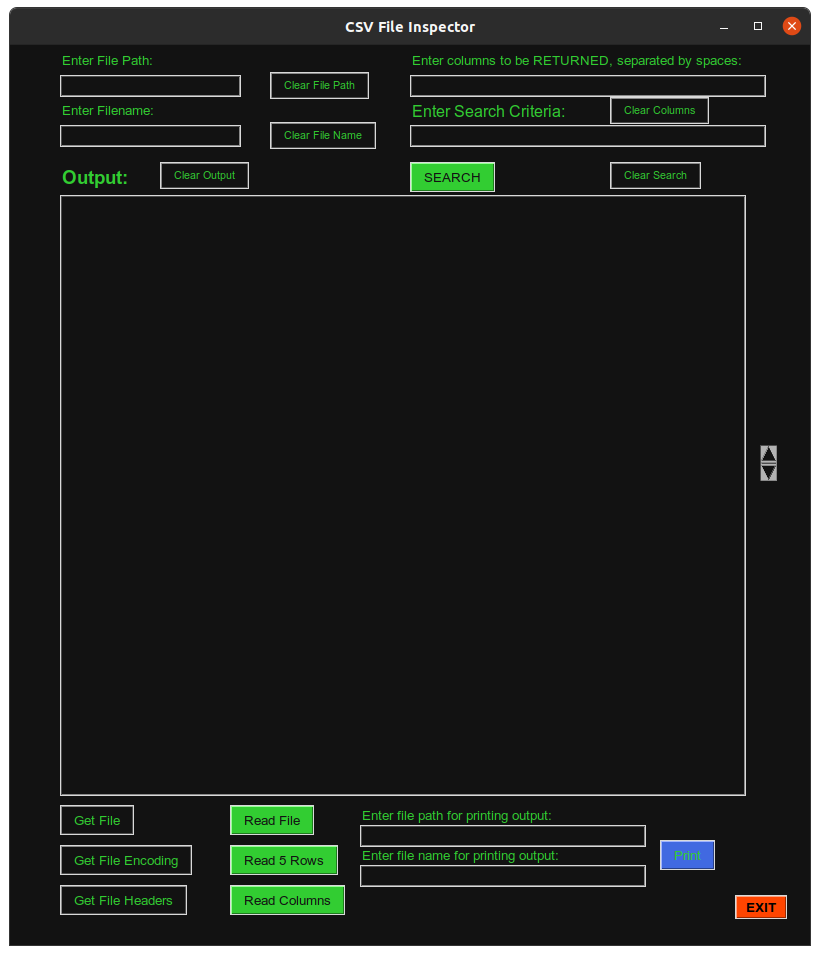

# CSV FILE INSPECTOR

* Program name: csv_insp.py
* Program Creator: promontorycoder

- Purpose of Program: 
    - Assist with examination of large csv file databases.
    - Creator used to help with python and tkinter learning.

- Credits:
    - Online world for all of the training and information the author has
    received.        
________________________________________________________________________________

## REQUIREMENTS FOR UBUNTU 20.04
________________________________________________________________________________

- python3:
    - sudo apt-get install -y python3
    
- tkinter: 
    - sudo apt-get install -y python3-tk 
________________________________________________________________________________

## GIT CLONE LINK
________________________________________________________________________________

To git clone into the repository folder, enter the following command into 
Terminal after navigating from within Terminal to the folder you'd like the
program folder to be cloned to:

    git clone https://github.com/promontorycoder/csv_insp.git
________________________________________________________________________________

## INSTALLATION INSTRUCTIONS FOR UBUNTU 20.04
________________________________________________________________________________

#### Step 1: Acquire program files
    Copy files via git clone or other method to chosen install folder

#### Step 2: Make program files executable
- Open gnome-terminal and navigate to folder with downloaded program files
- Enter the following commands into gnome-terminal:
     - chmod +x csv_insp.py
     - chmod +x csv_insp.sh
     - chmod +x csv_insp_start.desktop
        
#### Step 3: Edit files to reflect your directory structure
- Open csv_insp.sh into text editor and change line 2 file path to match your
    - file structure.
    - Save and exit file. 
- Open csv_insp_start.desktop into text editor and change lines 5, 6 and 7 to 
    - match your file structure.
    - Save and exit file
    
#### Step 4: Install tkinter if you do not already have it installed.
- Open gnome-terminal and execute the following command:
    - sudo apt-get install -y python3-tk
        
#### Step 5: Copy .desktop file to /usr/share/applications
- Open gnome-terminal and enter the following command:
    - sudo cp csv_insp_start.desktop /usr/share/applications
________________________________________________________________________________

